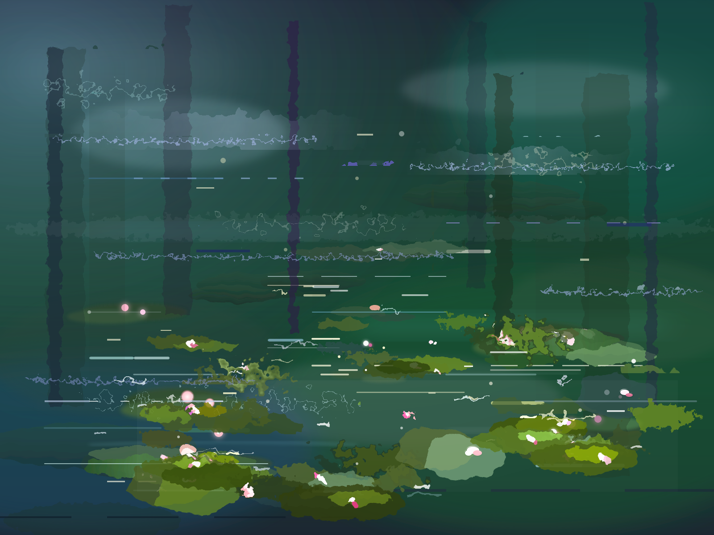
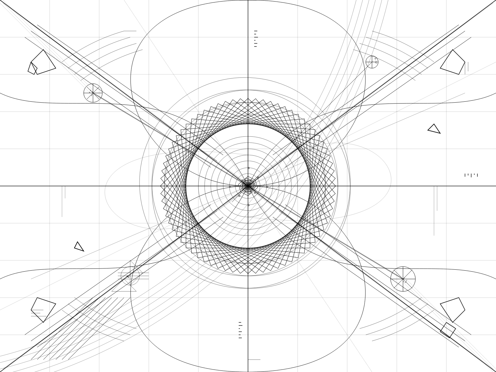
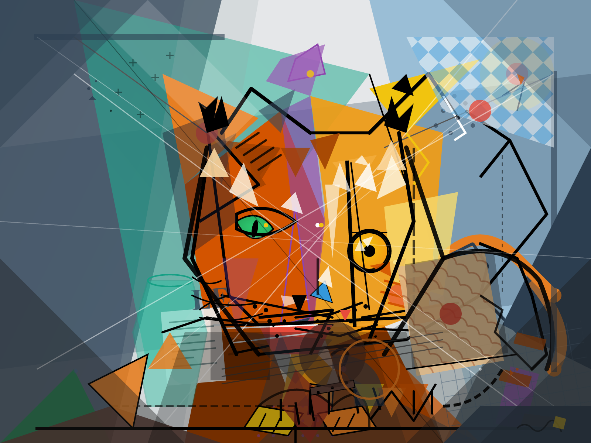

# Monet

LLM-powered iterative SVG art generator. Give it a prompt, and an LLM will draw it — one layer at a time — by writing SVG elements, rendering the canvas, looking at what it made, and iterating.

## Setup

Requires Python 3.14+ and [uv](https://docs.astral.sh/uv/).

```bash
uv sync
```

You'll need at least one API key. Create a `.env` file:

```
ANTHROPIC_API_KEY=sk-ant-...
GOOGLE_API_KEY=AIza...
```

## Usage

```bash
# Basic usage (defaults to Anthropic Claude)
uv run monet "a sunset over the ocean"

# Use Gemini instead
uv run monet "a cat on a windowsill" -p gemini

# All options
uv run monet "abstract geometry" \
  -p gemini \
  -m gemini-3-pro-preview \
  --max-iterations 20 \
  --width 600 --height 600 \
  --background "#000000" \
  -o ./my_art/ \
  -v
```

### Recommended models

Monet uses thinking during the planning phase (iteration 0) to reason through composition, palette, and technique before drawing. The drawing iterations run without thinking for speed and intuition. We recommend models that support level-based thinking control:

- **Gemini 3 Flash** (`-p gemini`) — fast, cheap, good quality. The default Gemini model.
- **Gemini 3 Pro** (`-p gemini -m gemini-3-pro-preview`) — best Gemini quality.
- **Claude Sonnet 4.6** (default) — strong all-round choice.
- **Claude Opus 4.6** (`-m claude-opus-4-6`) — best overall quality.

Older models (Gemini 2.5, Claude 4.5 and earlier) use token-budget-based thinking which is deprecated by both providers.

Output goes to `output/<timestamp>_<slug>/` with:
- `iter-001.svg`, `iter-001.png`, ... — each iteration's canvas
- `final.svg`, `final.png` — the finished piece (PNG at 2x resolution)
- `artist-log.txt` — the LLM's artistic notes and planning from each iteration

## Examples

| Prompt | Result |
|--------|--------|
| *"a pond of water lilies in the style of Claude Monet"* |  |
| *"a self-portrait of your inner experience"* |  |
| *"ginger cat in the style of picasso"* |  |

## Cost estimates

A typical artwork takes 10-15 drawing iterations, plus a planning iteration (iteration 0) that uses thinking. Each drawing iteration sends system prompt + art prompt + growing artist notes + canvas image, and receives ~1000-1500 output tokens of SVG and notes.

Estimates below are for a **15-iteration session** (16 API calls total) including the planning overhead. The planning phase uses adaptive/high-effort thinking and costs more than a regular iteration. Gemini estimates assume no caching (implicit caching is available but hit rates are unreliable). Anthropic estimates include incremental prompt caching — each iteration reads the previous call's cached prefix (~46% input cost savings).

### Gemini (no caching)

| Model | Input | Output | Total | Notes |
|-------|-------|--------|-------|-------|
| **Gemini 3 Flash Preview** | ~$0.02 | ~$0.07 | **~$0.09** | Default Gemini model. |
| **Gemini 3 Pro Preview** | ~$0.09 | ~$0.28 | **~$0.37** | Best Gemini quality. |

### Anthropic (with incremental caching)

| Model | Input | Output | Total | Notes |
|-------|-------|--------|-------|-------|
| **Claude Sonnet 4.6** | ~$0.11 | ~$0.35 | **~$0.46** | Default model. |
| **Claude Opus 4.6** | ~$0.18 | ~$0.59 | **~$0.76** | Best quality. Under $1 per artwork. |

Gemini models have a generous free tier for low-volume usage.

## How it works

Each iteration, the LLM sees the current canvas as an image and outputs new SVG elements to layer on top. It keeps its own "artist notes" as a scratchpad for planning across iterations. The loop runs until the LLM signals it's done or hits the max iteration count.

## License

MIT
